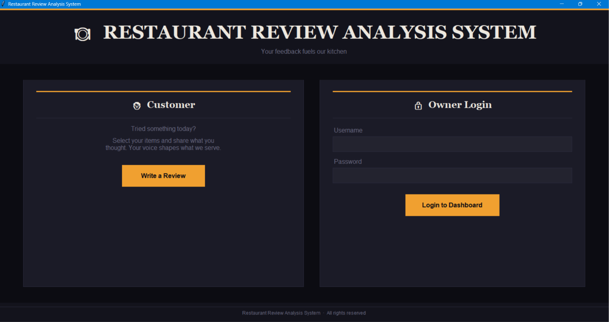
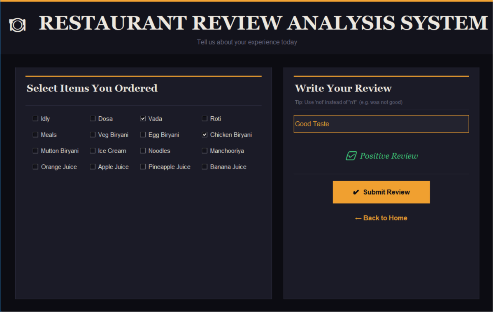
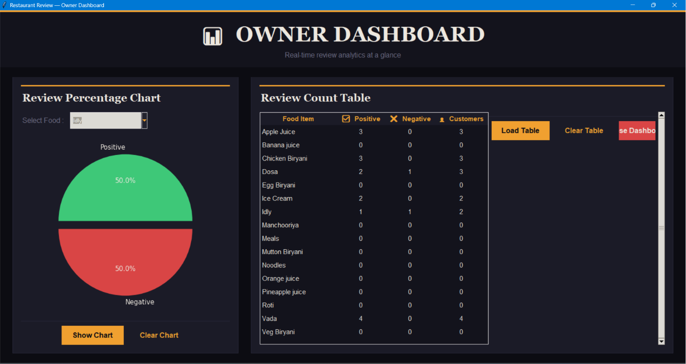
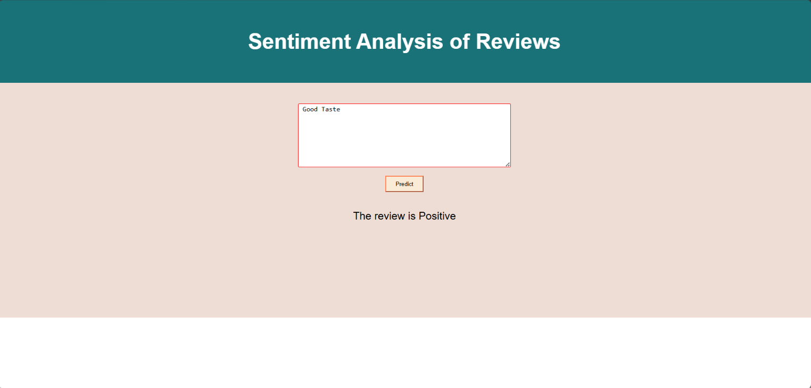

# 🍽️ Restaurant Review Analysis System

<p align="center">
  
  
  
  
  
  
  
</p>

<p align="center">
  An end-to-end NLP project that classifies restaurant reviews as <strong>Positive</strong> or <strong>Negative</strong> using a Logistic Regression model — with three complete interfaces: a Flask web app, a feature-rich Tkinter desktop GUI, and a MySQL-backed analytics dashboard for restaurant owners.
</p>

---

## 📌 Table of Contents

- [Overview](#-overview)
- [Features](#-features)
- [Project Architecture](#-project-architecture)
- [Dataset](#-dataset)
- [Project Structure](#-project-structure)
- [Tech Stack](#-tech-stack)
- [NLP Pipeline](#-nlp-pipeline)
- [Interfaces](#-interfaces)
  - [Flask Web App](#-flask-web-app)
  - [Tkinter Desktop GUI](#-tkinter-desktop-gui)
  - [Owner Dashboard](#-owner-dashboard)
- [Database Schema](#-database-schema)
- [Installation & Usage](#-installation--usage)
- [Screenshots](#-screenshots)
- [Author](#-author)
- [License](#-license)

---

## 🧠 Overview

The **Restaurant Review Analysis System** is a complete NLP project that takes a customer's written review as input and predicts whether the sentiment is **positive** or **negative** using a trained **Logistic Regression classifier** with **CountVectorizer** text features.

What makes this project stand out from a simple sentiment classifier is the full ecosystem built around it:

- A **Flask web application** where customers can submit reviews and get instant predictions
- A **Tkinter desktop GUI** with a dark-themed interface where customers select food items and write reviews
- A **restaurant owner's dashboard** with a login system, live review count table, and per-item pie charts pulled from a **MySQL database**
- An end-to-end flow where every review submitted through the GUI is stored in the database and the owner can track sentiment per food item in real time

---

## ✨ Features

- 📝 Accepts free-text restaurant reviews and classifies them as Positive or Negative
- 🍛 Tracks sentiment across 16 specific food items (Idly, Dosa, Biryani, Juices, etc.)
- 🗄️ Stores review counts in a MySQL database (good_review, bad_review, customer count)
- 🔒 Owner login system with a protected analytics dashboard
- 📊 Per-food pie chart visualization of Positive vs Negative review percentages
- 📋 Review count table showing stats for every menu item
- 🌐 Flask web interface for browser-based predictions
- 🖥️ Full desktop GUI built with Tkinter — dark-themed, production-grade UI
- 💾 Pre-trained model loaded from `.pkl` files — no retraining needed
- 🔤 Text preprocessing: lowercase, regex cleaning, Porter Stemming

---

## 🏗️ Project Architecture

```
Customer writes review
        │
        ▼
  [Web App / GUI]
        │
        ▼
Text Preprocessing
  • Lowercase
  • Remove special characters (regex)
  • Porter Stemming (NLTK)
        │
        ▼
CountVectorizer (cvmodel)
  • Transforms text into bag-of-words feature vector
        │
        ▼
Logistic Regression Model (lgmodel)
  • Predicts: 1 = Positive, 0 = Negative
        │
        ├──► Display result to customer
        │
        └──► Update MySQL database
               (good_review / bad_review / customer count)
                        │
                        ▼
               Owner Dashboard
               • Pie charts per food item
               • Review count table
```

---

## 📊 Dataset

| Property     | Details                                          |
|--------------|--------------------------------------------------|
| **File**     | `r_data.tsv` (Tab-Separated Values)              |
| **Format**   | TSV — Review text + Sentiment label (0 or 1)     |
| **Labels**   | `1` = Positive review, `0` = Negative review     |
| **Task**     | Binary Sentiment Classification                  |

---

## 📁 Project Structure

```
RestaurantReviewAnalysis/
│
├── web_app.py              # Flask web application (browser interface)
├── gui_app.py              # Tkinter desktop GUI + Owner dashboard
├── db.ipynb                # MySQL database setup notebook
├── restapp.ipynb           # Model training notebook (NLP pipeline)
├── cvmodel                 # Saved CountVectorizer (pickle)
├── lgmodel                 # Saved Logistic Regression model (pickle)
├── r_data.tsv              # Training dataset
├── requirements.txt        # Python dependencies
├── templates/
│   └── index.html          # HTML template for Flask web app
└── README.md               # Project documentation
```

---

## 🛠️ Tech Stack

| Tool / Library     | Purpose                                      |
|--------------------|----------------------------------------------|
| Python 3.8+        | Core programming language                    |
| NLTK               | Natural Language Processing (PorterStemmer)  |
| Scikit-learn       | CountVectorizer + Logistic Regression model  |
| Pandas / NumPy     | Data handling and preprocessing              |
| Flask              | Web application framework                    |
| Tkinter            | Desktop GUI framework                        |
| Matplotlib         | Pie chart visualizations in GUI              |
| PyMySQL            | MySQL database connection                    |
| MySQL              | Persistent storage for review counts         |
| Pickle             | Model serialization / deserialization        |

---

## 🔬 NLP Pipeline

```
Raw Review Text
      │
      ▼
Lowercase Conversion
  e.g. "Great Food!" → "great food!"
      │
      ▼
Regex Cleaning
  Remove all non-alphabetic characters
  e.g. "great food!" → "great food"
      │
      ▼
Tokenization
  Split into individual words
      │
      ▼
Porter Stemming (NLTK)
  Reduce words to root form
  e.g. "running", "runs" → "run"
      │
      ▼
Rejoin tokens into clean string
      │
      ▼
CountVectorizer Transform
  Converts text to numerical feature vector
  (Bag-of-Words representation)
      │
      ▼
Logistic Regression Prediction
  Output: 1 (Positive) or 0 (Negative)
```

> **Note:** The GUI app also applies a `not`-word override: if the word "not" appears in the review, the prediction is flipped — a simple but practical heuristic to handle negations like *"not good"*.

---

## 📈 Model Performance

| Metric         | Score  |
|----------------|--------|
| **Accuracy**   | 81.29% |
| **Precision**  | 0.85   |
| **Recall**     | 0.82   |
| **F1-Score**   | 0.83   |
| **Algorithm**  | Logistic Regression |
| **Test Samples** | 278  |

### Confusion Matrix

|                  | Predicted Negative | Predicted Positive |
|------------------|--------------------|--------------------|
| **Actual Negative** | 97 ✅             | 23 ❌              |
| **Actual Positive** | 29 ❌             | 129 ✅             |

> Model correctly identified **129 positive** and **97 negative** reviews.
> False positives: 23 | False negatives: 29
---

## 🖥️ Interfaces

### 🌐 Flask Web App

`web_app.py` — Browser-based interface built with Flask.

- Customer visits the homepage (`/`) served by `index.html`
- Enters a review in the text form
- On form submission, text is preprocessed and passed to the loaded model
- Prediction is displayed directly on the page: **"The review is Positive"** or **"The review is Negative."**

**Routes:**
| Route      | Method | Description                          |
|------------|--------|--------------------------------------|
| `/`        | GET    | Renders the homepage with review form|
| `/predict` | POST   | Processes review and returns result  |

---

### 🖥️ Tkinter Desktop GUI

`gui_app.py` — Full dark-themed desktop application.

The main window presents two panels:

**Customer Panel:**
- Click "Write a Review" to open the review submission window
- Select food items you ordered (checkboxes: 16 menu items)
- Write your review in a text area
- Click "Submit Review" — sentiment is predicted and displayed live
- The review result is automatically saved to the MySQL database under the selected food items

**Owner Panel:**
- Username / Password login (secured)
- On successful login, opens the Owner Dashboard

---

### 📊 Owner Dashboard

A separate dashboard window with two panels:

**Left Panel — Pie Chart:**
- Select any food item from the dropdown
- Click "Show Chart" → displays a Positive vs Negative pie chart for that item
- Data is fetched live from the MySQL database
- Color coded: Green = Positive, Red = Negative

**Right Panel — Review Count Table:**
- Loads a full table of all 16 food items
- Columns: Food Item | ✅ Positive | ❌ Negative | 👤 Total Customers
- Buttons: Load Table, Clear Table, Close Dashboard

---

## 🗄️ Database Schema

**Database:** `rest_review_db`

**Table:** `reviews_table`

| Column        | Type         | Description                          |
|---------------|--------------|--------------------------------------|
| `food`        | VARCHAR(40)  | Food item name (Primary Key)         |
| `good_review` | INT          | Count of positive reviews            |
| `bad_review`  | INT          | Count of negative reviews            |
| `customer`    | INT          | Total number of customers reviewed   |

**Pre-loaded food items:**
Idly, Dosa, Vada, Roti, Meals, Veg Biryani, Egg Biryani, Chicken Biryani, Mutton Biryani, Ice Cream, Noodles, Manchooriya, Orange Juice, Apple Juice, Pineapple Juice, Banana Juice

---

## 💻 Installation & Usage

### 1. Clone the Repository

```bash
git clone https://github.com/adityabobade7900/RestaurantReviewAnalysis.git
cd RestaurantReviewAnalysis
```

### 2. Install Dependencies

```bash
pip install -r requirements.txt
```

`requirements.txt` includes:
```
pandas
numpy
scikit-learn
nltk
matplotlib
seaborn
flask
requests
pymysql
```

### 3. Set Up MySQL Database

Make sure MySQL is running locally, then run the `db.ipynb` notebook cell by cell to:
- Create the `rest_review_db` database
- Create the `reviews_table` table
- Insert all 16 food items with zero counts

> Update the MySQL credentials in `db.ipynb` and `gui_app.py` to match your local MySQL setup before running.

### 4a. Run the Flask Web App

```bash
python web_app.py
```

Open your browser at:
```
http://localhost:5000
```

### 4b. Run the Tkinter Desktop GUI

```bash
python gui_app.py
```

The desktop GUI will launch in fullscreen mode.

> **Owner Login Credentials (default):** Username: `Aditya` | Password: `7900`

---

## 📸 Screenshots

### 🏠 Main Window


### 📝 Review Submission


### 📊 Owner Dashboard


### 🌐 Flask Web App


---

## 👨‍💻 Author

**Aditya Bobade**
Data Analyst | Python | MySQL | Power BI | Machine Learning | NLP

[](https://github.com/adityabobade7900)
[](https://www.linkedin.com/in/adityabobade7900)
[](https://adityabobade7900.github.io/adityabobade/)

---

## 📞 Need Help?

If you have any questions, run into issues, or just want to suggest something — feel free to reach out directly. I'm happy to help.

| Platform   | Link                                                                        |
|------------|-----------------------------------------------------------------------------|
| 💼 LinkedIn | [linkedin.com/in/adityabobade7900](https://www.linkedin.com/in/adityabobade7900) |
| 📧 Email    | [bobade1436@gmail.com](mailto:bobade1436@gmail.com)                         |
| 🐙 GitHub   | [github.com/adityabobade7900](https://github.com/adityabobade7900)          |

> If something's unclear in the docs or you're stuck setting up the project, just drop a mail at **bobade1436@gmail.com** — I'll respond as soon as I can.

---

## 📄 License

This project is licensed under the **MIT License** — free to use, modify, and distribute with attribution.

---

> ⭐ **If you found this project useful, please give it a star on GitHub!** ⭐
